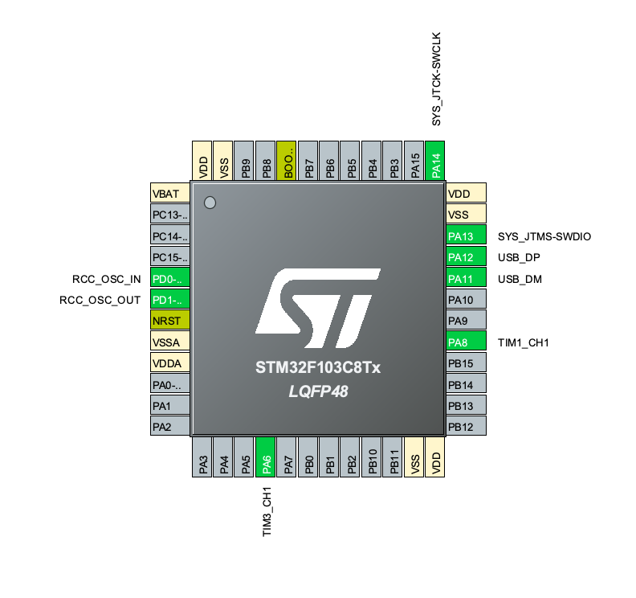

# PWMControl
**PWMControl** allows you to setup two PWM outputs by directly controlling their approprieate registers. The application is written for the STM32f103 a.k.a. BluePill but may be easily ported to other controllers of the STM32 family.  
After you've compiled and flashed the binary, connect via serial, which is provided as VCP via USB, and command as you whish.  
## Features
|||
|---|---|
|Two timers|Control two PWM outputs independently
|Serial over USB|Just connect via USB and go
|Extendable|Missing some features? PWMControl is easy to extend!
## Commands        
The command syntax is as follows:  
`<timer>:<command>:<argument>`  
where `<timer>` is the desired timer `t1`or `t2`. `<command>` and `<argument>` are described below:

|Command      | Function         | Arguments |
|---|---|---|
|`start`|Starts the timer|N/A
|`stop`|Stops imer execution|N/A
|`duty`|Sets the duty cycle|0..100|
|`period`|Sets the period|[0..65535]
|`compare`|Sets the comare value|[0..65535]
|`prescaler`|Sets the prescaler|[0..65535]
|`status`|Prints the status of the timer|N/A

Each recognized command is acknowledged with an `OK`.

### Example  
In order to run timer1 with **50%** dutycycle and a period of **1ms** assuming the the clock is running at **72MHz** issue the following commands:  
```
t1:prescaler:719
OK
t1:period:99
OK
t1:compare:49
OK
t1:start
OK
```
`t1:prescaler:7199` will set the prescaler to `719`. At a clock speed of **72MHz** the timer clock will become **100kHz**. Then the period is set to `99` and compare `49`. If you are confused due to of the odd values, dont't forget that the timer values `period`, `prescaler` and `compare` are always substracted by `1`.

## Pinout


|Pin      | Function         |
|---|---|
|PA6|Timer1 Output|
|PA8|Timer2 Output|
